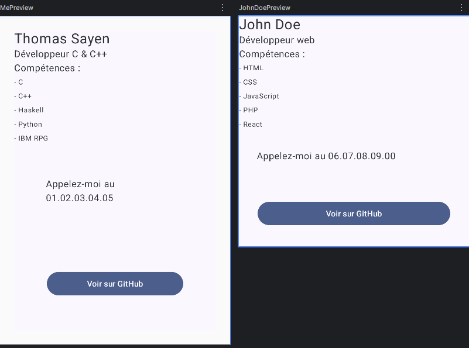

# Profil développeur

Ce projet affiche une description professionnelle, en listant les compétences de la personne et diverses informations pertinentes.  

## Composants utilisés

- Text: affiche du texte
- Icon: affiche une icône (on a utilisé des icônes préinstallées avec Material)
- Image: affiche une image (on a utilisé une icône préinstallée avec Material)
- Button: bouton avec une action lors de l'appui

## Layouts utilisés

- Row: pour regrouper plusieurs éléments sur une même ligne
- Column: pour regrouper plusieurs éléments sur une même colonne
- Surface: un conteneur pour stocker des sous-éléments
- LazyColumn

## LazyColumn

LazyColumn a été utilisé pour construire les listes des projets et des compétences.  
C'est la même chose que Column, à la différence près que LazyColumn est dynamique et gère des collections (List<?> par exemple).  
Si les éléments dépassent la hauteur de l'écran, LazyList ne calculera et n'affichera que les éléments affichables, pas ceux plus bas que l'écran.
Chaque élément de la liste (projet ou compétence) est dans un composable dédié, puis réutilisé par LazyColumn.  

## Thèmes

On a créé deux schémas de couleurs DarkColorScheme et LightColorScheme pour lister les couleurs de l'interface, selon si on est en thème sombre ou clair.  
On crée ensuite le thème ProfileTheme qui va sélectionner dynamiquement le schéma de couleurs adapté, en utilisant une fonction système permettant de savoir si l'on est en thème clair ou sombre.  

## Visuels

## Notions utilisées

- Composables : décorateur `@Composable`, permet à une fonction d'être réutilisée
- Paramètres : arguments des fonctions composables, pour personnaliser un composable
- Modifiers : paramètre de type `Modifier` sur les composables, pour personnaliser l'affichage
- Padding : méthode `.padding()` de `Modifier`, pour ajouter des marges autour du contenu des composables (padding externe = padding autour du composable principal, padding interne = padding dans un composable)
- Callbacks : fonction passée en argument d'un composable pour qu'il l'appelle (par exemple `onClick` pour passer une fonction à bouton, appelée à chaque clic sur le bouton)
- Previews : configurations de test
- Accessibilité : role `modifier.clickable(role = Role.Button)` et `modifier.semantics { contentDescription = ... }`
